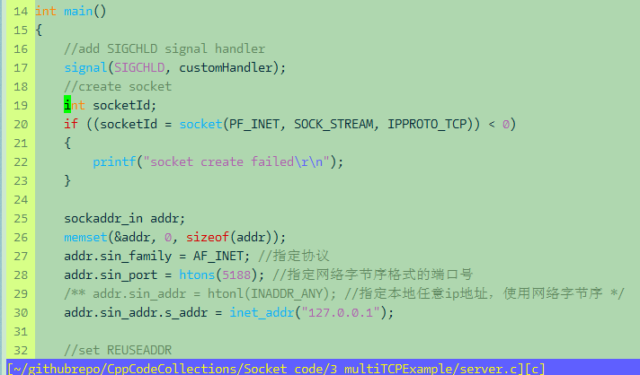
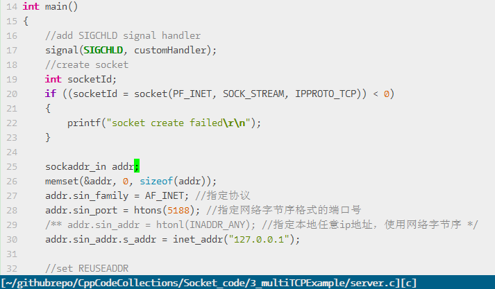
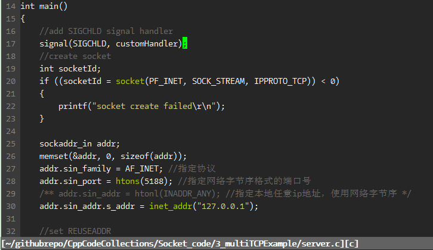

## ChangeLogs
* 2020/9/2: add customed vim one theme, inspired vim-one repo

## 豆沙绿背景色 
Bgreen with light blackground:  
**Note:**: 该配色背景依赖终端的颜色，需要优先把终端背景色设置好
* Light theme: 
    * 设置终端背景色为豆沙绿（204，232，207）
    * set background = light
* dark theme:
    * 设置终端背景色为暗色
    * set background = dark

### 白色背景色
Bwhite with light blackground:  

### 灰黑色背景色
Bblack:  

